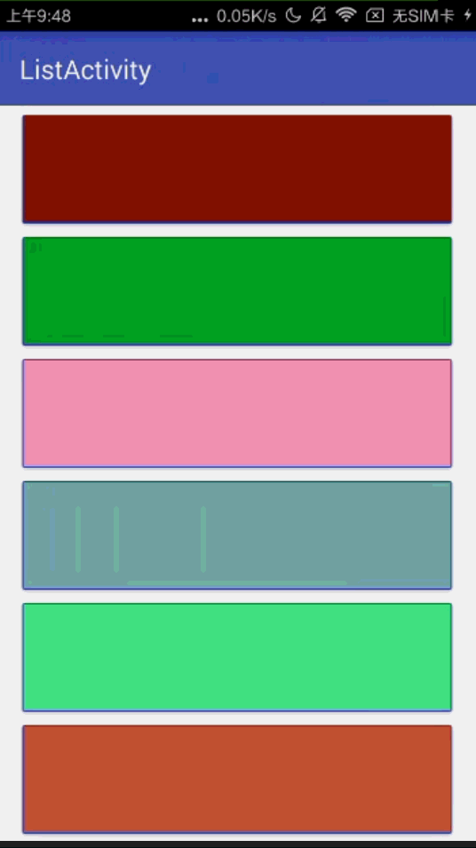

##BouncingJellyView

### 最新版本: 1.0.2

可以嵌套任何View，滑动到顶部或者底部，会有一个阻尼效果进行缩放整个页面，松开手指回弹。灵感来自于MIUI。

### 效果图
#### 1. 普通的页面

#### 2. 嵌套RecyclerView

### 使用
1. 添加Jitpack
	
	allprojects {
		repositories {
			...
			maven { url 'https://jitpack.io' }
		}
	}
2. 在gradle中compile

		com.github.aohanyao:bouncing-jelly-view:最新版本

3. xml
	
		因为BouncingJellyView是继承自ScrollView，所以必须要嵌套一层ViewGroup才能使用。


```xml
			
	<com.aohanyao.jelly.library.BouncingJellyView xmlns:android="http://schemas.android.com/apk/res/android"
	    xmlns:app="http://schemas.android.com/apk/res-auto"
	    xmlns:tools="http://schemas.android.com/tools"
	    android:layout_width="match_parent"
	    android:layout_height="match_parent" >

		<任意ViewGroup>
			.........你的内容
		</任意ViewGroup>

	</com.aohanyao.jelly.library.BouncingJellyView>

```


 

### Version History
### 2018年3月6日
修复[issues/1#](https://github.com/aohanyao/BouncingJelly/issues/1#issuecomment-370310890)

#### 2018年3月5日
剔除多余的包

#### 2017年1月11日
1.0.0 

	初步完成，增加到仓库。